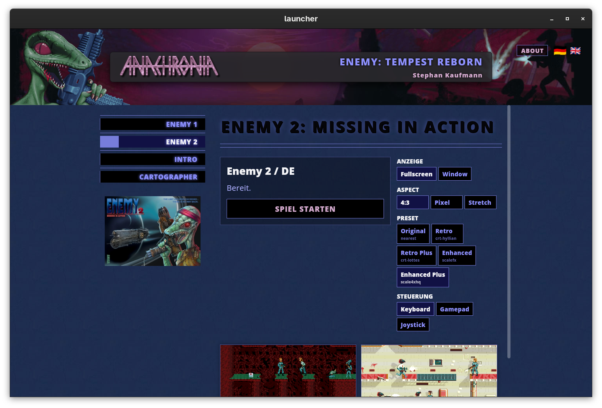
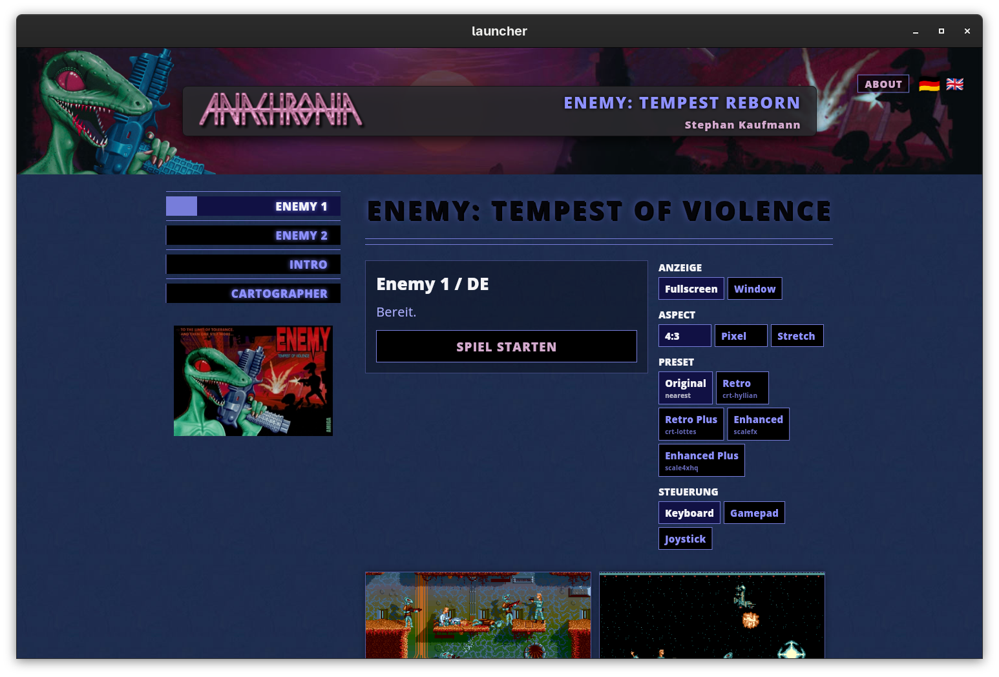

# Enemy: Tempest Reborn

Version 0.6

Enemy: Tempest Reborn ist ein einfaches Launcher-Paket, um Enemy 1 und Enemy 2
ueber FS-UAE zu spielen. Ziel ist ein unkomplizierter Start mit klarem Menue,
vorbereiteten Einstellungen und einigen Grafik-Presets.

## Features

- Enemy 1: Tempest of Violence
- Enemy 2: Missing in Action
- Deutsche und englische Spielversionen
- Separater Enemy-1-Intro-Start
- Fullscreen als Standard
- Vorbereitete Grafik-Presets:
  - Original
  - Retro
  - Retro Plus
  - Enhanced
  - Enhanced Plus
- Tastatur-, Joystick- und Gamepad-Profile
- Levelauswahl fuer normales Spielen vorbereitet
- Kurzer Start-Splash, waehrend das Amiga-System startet
- Windows-Installer
- Linux-AppImage
- Portable Pakete fuer Linux, Windows und macOS

## Das Menue

Im Menue waehlst du Spiel, Sprache, Grafik-Preset, Bildschirmmodus und
Steuerung, bevor FS-UAE gestartet wird.

Enemy 1 startet direkt ins Spielmenue. Das Intro ist ein eigener Menuepunkt,
damit der Spielstart schnell bleibt und das Intro trotzdem jederzeit verfuegbar
ist.

Die Grafik-Presets sind bewusst einfach gehalten:

- Original zeigt den klassischen scharfen Look.
- Retro nutzt eine CRT-artige Darstellung.
- Enhanced glaettet die Pixelgrafik staerker.

## Steuerung

Tastatur, Joystick und Gamepad koennen im Menue ausgewaehlt werden. Die
Tastatur nutzt Cursor-Tasten und WASD fuer Bewegung. Gamepad und Joystick sind
naeher am klassischen Amiga-Spielgefuehl.

## Release-Pipeline

Das Projekt nutzt GitHub Actions fuer die Release-Pakete. Ein Release-Tag
startet die Paket-Builds fuer Linux, Windows und macOS. Die Pipeline erzeugt
portable Archive, das Linux-AppImage und den Windows-Installer und laedt alles
in das GitHub-Release hoch.

## Dank

Danke an das AROS-Projekt fuer die freie Amiga-kompatible Systemarbeit, die
dieses Paket moeglich macht.

Besonderer Dank an André Wüthrich <anachronia@gmail.com> fuer Enemy und
Anachronia.

## Lizenz

Siehe `LICENSES.md` fuer die enthaltenen Lizenzen und Hinweise zu Drittteilen.
